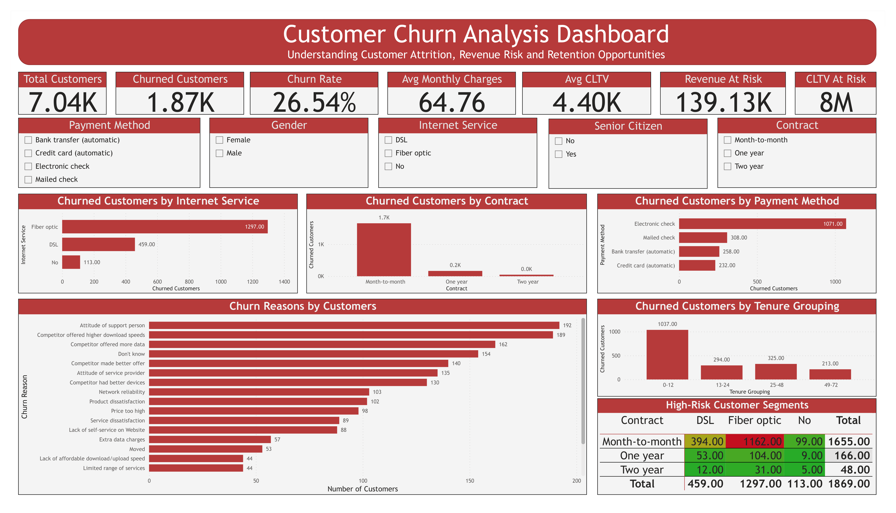

# Customer Churn Analysis

## Project Overview

This project analyzes customer churn behavior in a telecommunications company using SQL, Python, and Power BI. The objective is to identify the key drivers of customer attrition, estimate the business impact of churn, and provide actionable recommendations to improve customer retention.

---

## Business Problem

Customer churn is one of the most important challenges faced by subscription-based businesses. Losing customers leads to reduced revenue, lower customer lifetime value, and increased acquisition costs.

This project aims to answer the following questions:

* What is the overall churn rate?
* Which customer segments are most likely to churn?
* Which services and payment methods are associated with higher churn?
* What are the primary reasons customers leave?
* What is the potential financial impact of customer attrition?

---

## Dataset

**Source:** IBM Telco Customer Churn Dataset (Kaggle)

* Total Customers: 7,043
* Features: 33 columns
* Churned Customers: 1,869
* Customer Retention Rate: 73.46%
* Customer Churn Rate: 26.54%

---

## Tools and Technologies

* SQL (SQLite)
* Python
* Pandas
* NumPy
* Matplotlib
* Seaborn
* Power BI
* Git
* GitHub

---

## Project Structure

```text
Customer-Churn-Analysis/
│
├── dashboard/
│   ├── customer_churn_dashboard.pbix
│   │
│   └──images/
│       └── customer_churn_dashboard.png
│
├── data/
│   ├── raw/
│   │   └── Telco_Customer_Churn.csv
│   └── processed/
│       ├── clean_telco_churn.csv
│       └── customer_churn.db
│
│
├── notebooks/
│   └── churn_analysis.ipynb
│
├── sql/
│   ├── basic_queries.sql
│   ├── advanced_queries.sql
│   └── churn_kpis.sql
│
└── README.md
```

---

# Dashboard



---

## Data Cleaning and Preparation

The following steps were performed:

* Verified dataset dimensions and data types
* Checked for duplicate records
* Verified unique Customer IDs
* Investigated missing values
* Created tenure groups for customer segmentation
* Exported cleaned data to CSV and SQLite database

---

## Exploratory Data Analysis (EDA)

Analysis focused on:

* Customer churn distribution
* Contract type analysis
* Internet service analysis
* Payment method analysis
* Senior citizen behavior
* Customer tenure segmentation
* Customer lifetime value (CLTV)
* Revenue at risk
* Churn reasons analysis

---

## Key Findings

### Overall Churn Rate

* Total Customers: 7,043
* Churned Customers: 1,869
* Churn Rate: **26.54%**

---

### Highest-Risk Customer Segment

Month-to-month customers using Fiber Optic internet had the highest churn rate:

* Total Customers: 2,128
* Churned Customers: 1,162
* Churn Rate: **54.61%**

---

### Contract Analysis

| Contract Type  | Churn Rate |
| -------------- | ---------- |
| Month-to-month | 42.71%     |
| One year       | 11.27%     |
| Two year       | 2.83%      |

Long-term contracts significantly reduce customer churn.

---

### Internet Service Analysis

| Internet Service    | Churn Rate |
| ------------------- | ---------- |
| Fiber optic         | 41.89%     |
| DSL                 | 18.96%     |
| No internet service | 7.40%      |

Fiber Optic customers exhibit the highest risk of churn.

---

### Payment Method Analysis

| Payment Method            | Churn Rate |
| ------------------------- | ---------- |
| Electronic check          | 45.29%     |
| Mailed check              | 19.11%     |
| Bank transfer (automatic) | 16.71%     |
| Credit card (automatic)   | 15.24%     |

Electronic check customers have substantially higher churn rates.

---

### Senior Citizen Analysis

| Customer Group      | Churn Rate |
| ------------------- | ---------- |
| Senior Citizens     | 41.68%     |
| Non-Senior Citizens | 23.61%     |

Senior citizens are significantly more likely to leave the company.

---

### Customer Tenure Analysis

| Tenure Group | Churn Rate |
| ------------ | ---------- |
| 0–12 Months  | 47.44%     |
| 13–24 Months | 28.71%     |
| 25–48 Months | 20.39%     |
| 49–72 Months | 9.51%      |

Customer loyalty increases considerably with tenure.

---

### Top Churn Reasons

1. Attitude of support person
2. Competitor offered higher download speeds
3. Competitor offered more data
4. Competitor made better offer
5. Network reliability
6. Price too high
7. Product dissatisfaction

---

### Business Impact

**Average Monthly Charges:** $64.76

**Average Customer Lifetime Value (CLTV):** $4.40K

**Revenue at Risk:** approximately **$139K per month**

**Customer Lifetime Value at Risk:** approximately **$8M**

---

## Recommendations

### 1. Convert Month-to-Month Customers to Long-Term Contracts

Offer discounts, loyalty rewards, and retention campaigns to encourage contract upgrades.

### 2. Investigate Fiber Optic Customer Experience

Review pricing, network reliability, and competitor offerings to address the high churn rate.

### 3. Improve Customer Support Quality

Support-related complaints are among the most common churn reasons and should be addressed through employee training and service quality initiatives.

### 4. Target Electronic Check Customers

Implement personalized retention campaigns and investigate whether payment friction contributes to churn.

### 5. Develop Retention Programs for Senior Citizens

Create specialized support and onboarding programs for vulnerable customer groups.

### 6. Prioritize New Customers

Customers with less than one year of tenure represent the highest-risk segment and should receive proactive engagement strategies.

---

## Skills Demonstrated

* Exploratory Data Analysis (EDA)
* Data Cleaning and Validation
* SQL Querying and Aggregation
* Customer Segmentation
* KPI Development
* Business Intelligence Reporting
* Dashboard Design
* Data Visualization
* Business Storytelling
* Git and GitHub Workflow
* End-to-End Analytics Project Development

---

## Conclusion

This project demonstrates an end-to-end customer churn analysis workflow, combining SQL, Python, and Power BI to identify the drivers of customer attrition, quantify business impact, and provide actionable recommendations for improving customer retention and reducing revenue loss.

## Author

Amirhossein Ashrafi

LinkedIn: https://www.linkedin.com/in/amirhosseinashrafi

GitHub: https://github.com/AmirhosseinAshrafi99